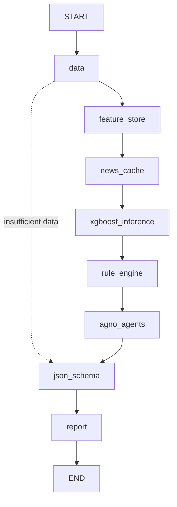

# Agent Graph

The graph mirrors the online area of the target architecture:

- User selection is normalized in `data`.
- Feature lookup is handled in `feature_store`; `news_cache` is deterministic by
  default and can collect live evidence only when `CAS_ENABLE_EXTERNAL_EVIDENCE=1`.
- Prediction and explanation stay separated: `xgboost_inference` produces the model
  result, while `agno_agents` runs the three-agent review scaffold
  (`quant_credit`, `evidence_audit`, `chair_report`). The default runner is
  deterministic; `CAS_STAGE2_RUNNER=agno` switches the same interface to Agno
  structured output.
- The final API payload is guarded by `json_schema` before dashboard rendering.
