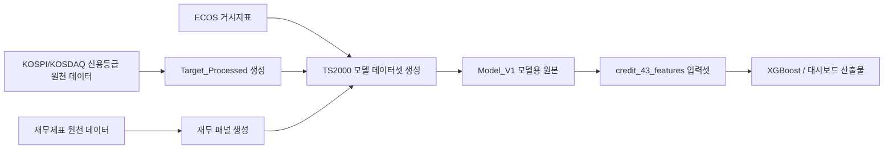

# 신용위험 모델 데이터 전처리 규칙

이 문서는 Corporate Analysis System에서 사용하는 신용위험 조기경보 모델의
주요 데이터 전처리 기준을 정리한다. 현재 기준 데이터는
`data/raw/ts2000/TS2000_Credit_Model_Dataset_Model_V1.csv`이며,
이 파일에서 43개 모델 입력셋과 대시보드용 산출물을 생성한다.

## 1. 전체 전처리 흐름

| 단계 | 산출물 | 역할 |
|---|---|---|
| 신용등급 타겟 처리 | `Target_Processed.csv`, `Target_Processed_audit.csv` | 기업-평가연도별 대표 신용등급과 이진 라벨 생성 |
| 재무/거시 결합 | `TS2000_Credit_Model_Dataset.csv` | 타겟, 재무제표, 시장/배당, 거시지표 결합 |
| 모델용 원본 정리 | `TS2000_Credit_Model_Dataset_Model_V1.csv` | 모델 학습에 필요한 ID, 시점, 변수, 타겟만 남김 |
| 43개 입력셋 생성 | `feature_43_master.csv`, `xgb_train.csv`, `xgb_valid.csv`, `xgb_test.csv` | XGBoost 학습 및 대시보드 입력 생성 |

## 2. 신용등급 타겟 전처리 기준

KOSPI와 KOSDAQ은 같은 규칙을 적용한다. 원천 파일은 시장별로
`KOSPI_Target.csv`, `KOSDAQ_Target.csv`를 따로 읽지만, 평가사 우선순위와
대표 등급 선택 방식은 동일하다.

### 2.1 사용 대상 신용등급

타겟으로 사용할 등급은 장기 기업신용 성격의 등급으로 제한한다.

| 구분 | 처리 기준 |
|---|---|
| 등급 유형 | 장기 신용등급만 사용 |
| 증권 성격 | 회사채, 무보증사채, 공모사채, 기업신용등급 등 장기 기업신용 성격만 사용 |
| 제외 대상 | 기업어음, 단기사채, 전환사채, 신주인수권부사채, 유동화증권, 보증 관련 등급 등 |
| 증권구분 코드 | 장기 회사채 성격 코드와 기업신용등급 코드 중심으로 사용 |

### 2.2 평가일과 기준연도 정렬

평가일이 불완전한 경우에는 보수적으로 연도 기준을 맞추기 위해 날짜를 보정한다.

| 항목 | 기준 |
|---|---|
| 평가월 누락 | 12월로 보정 |
| 평가일 누락 | 해당 월의 말일로 보정 |
| 평가연도 | 보정된 평가일의 연도 |
| 매칭 회계연도 | `fiscal_year = eval_year - 1` |

예를 들어 2024년에 평가된 신용등급은 2023 회계연도 재무제표와 연결한다.
즉 모델은 항상 `t년 재무/거시 정보`로 `t+1년 신용위험`을 예측한다.

### 2.3 평가사 우선순위

같은 기업과 같은 평가연도 안에 여러 평가기관의 등급이 존재할 수 있으므로,
다음 우선순위로 대표 등급을 선택한다.

| 우선순위 | 평가사 그룹 | 선택 기준 |
|---:|---|---|
| 1 | 국내 3대 평가사 | NICE신용평가, 한국신용평가, 한국기업평가 등급이 있으면 이 그룹을 우선 사용 |
| 2 | 기타 국내 평가사 | 국내 3대 평가사 등급이 없고 기타 국내 평가사 등급이 있으면 사용 |
| 3 | 외국 평가사 backfill | 국내 평가사 등급이 하나도 없을 때만 S&P, Fitch, JCR, Moody's 계열 등급 사용 |

선택된 평가사 그룹 안에서 여러 등급이 있으면 가장 낮은 등급을 대표 등급으로
선택한다. 이는 같은 기업-연도에 대해 보수적인 위험 판단을 유지하기 위한 기준이다.

### 2.4 라벨 변환 기준

최종 대표 등급은 투자적격 여부를 나타내는 이진 라벨로 변환한다.

| 라벨 | 등급 기준 | 의미 |
|---:|---|---|
| 0 | `AAA`부터 `BBB-`까지 | 투자적격 |
| 1 | `BB+` 이하 | 투기등급 또는 부적격 위험 |

Moody's 계열 등급처럼 표기 체계가 다른 경우에는 국내 등급 체계에 맞게 정규화한 뒤
동일한 기준으로 라벨을 부여한다.

### 2.5 상장 전 회계연도 제거

최종 타겟을 만든 뒤에는 상장일 정보를 활용해 상장 전 회계연도 행을 제거한다.

| 기준 | 처리 |
|---|---|
| `fiscal_year < listed_year` | 제거 |
| `fiscal_year >= listed_year` | 유지 |

예를 들어 토마토시스템은 상장연도가 2023년이므로, 현재 통일 기준에서는
2021년과 2022년 회계연도 행은 제거되고 2023년 회계연도 행만 남는다.

## 3. 재무/거시 데이터 결합 기준

타겟이 확정된 뒤에는 기업 프로필, 재무상태표, 손익계산서, 현금흐름표,
시장/배당 데이터, ECOS 거시지표를 결합한다.

| 데이터 | 결합 기준 | 처리 |
|---|---|---|
| 기업 프로필 | 시장, 종목코드, 회계연도 | 기업 식별정보와 상장연도 확보 |
| 재무상태표 | 시장, 종목코드, 회계연도 | 자산, 부채, 자본, 차입금 등 사용 |
| 손익계산서 | 시장, 종목코드, 회계연도 | 매출, 영업이익, 순이익 등 사용 |
| 현금흐름표 | 시장, 종목코드, 회계연도 | 영업현금흐름, 투자/재무현금흐름 등 사용 |
| 시장/배당 | 시장, 종목코드, 회계연도 | 배당 여부, 시장가치 관련 변수 보강 |
| ECOS 거시지표 | 회계연도 | 금리, 환율, 스프레드 등 거시 변수 결합 |

핵심 재무 패널은 프로필, 재무상태표, 손익계산서, 현금흐름표가 모두 존재하는
기업-연도 중심으로 구성한다. 이후 타겟 및 거시지표와 결합할 때도 기준 키가
맞지 않는 행은 모델 학습용 데이터에서 제외된다.

## 4. 파생 변수 생성 기준

재무 원천값에서 안정성, 수익성, 현금흐름, 성장성, 시장 관련 파생 변수를 만든다.
대표 변수는 다음과 같다.

| 변수 그룹 | 예시 |
|---|---|
| 안정성/레버리지 | 유동비율, 현금비율, 자기자본비율, 부채비율, 총차입금비율 |
| 수익성 | 순이익률, 영업 ROA, 세전 ROA, 세전 ROE |
| 현금흐름 | 영업현금흐름/부채, 영업현금흐름/차입금, 현금흐름 커버리지 |
| 시장/배당 | 배당지급 여부, 시장가치 대비 장부가치 |
| 추세/위험 플래그 | 총자산증가율, 순이익률 변화, 2년 연속 영업손실 여부, 이자보상배율 1 미만 여부 |
| 거시 | 기준금리, 환율, 회사채 스프레드 등 |

## 5. 43개 모델 입력셋 생성 기준

현재 대시보드와 Stage 1 XGBoost의 기본 입력은 `credit_43_features`이다.
이 입력셋은 34개 원천 변수를 선택한 뒤, 범주형 변수 3개를 원-핫 인코딩하여
최종 43개 모델 입력 변수로 만든다.

| 구분 | 개수 | 설명 |
|---|---:|---|
| 선택 원천 변수 | 34개 | 재무비율, 원천 재무값, 시장/규모/산업 맥락 변수, 거시 변수 포함 |
| 원-핫 대상 | 3개 | `market`, `firm_size_group`, `industry_macro_category` |
| 최종 모델 입력 | 43개 | XGBoost 학습 및 추론에 사용하는 실제 입력 변수 |

43개 입력셋은 다음 파일로 저장된다.

| 파일 | 설명 |
|---|---|
| `feature_43_master.csv` | 전체 5,199개 라벨 기업-연도 기준 테이블 |
| `xgb_train.csv` | 학습용 입력 |
| `xgb_valid.csv` | 검증용 입력 |
| `xgb_test.csv` | 테스트용 입력 |
| `xgb_id_train.csv`, `xgb_id_valid.csv`, `xgb_id_test.csv` | 각 split의 기업 식별정보 |

## 6. 시간순 분할과 누수 방지 기준

모델 검증은 임의 분할이 아니라 시간순 out-of-time 분할을 사용한다.

| Split | 기준 |
|---|---|
| Train | `fiscal_year <= 2021` |
| Validation | `fiscal_year == 2022` |
| Test | `fiscal_year >= 2023` |

현재 라벨 데이터 기준 split 규모는 다음과 같다.

| Split | 행 수 | 양성 라벨 수 | 양성 비율 |
|---|---:|---:|---:|
| Train | 3,851 | 878 | 22.80% |
| Validation | 676 | 176 | 26.04% |
| Test | 672 | 167 | 24.85% |

누수 방지 원칙은 다음과 같다.

| 원칙 | 설명 |
|---|---|
| 시점 정렬 | `fiscal_year=t` 재무/거시 정보로 `eval_year=t+1` 신용등급 예측 |
| 미래 정보 금지 | 미래 재무제표, 미래 거시지표, 미래 공시/뉴스는 과거 예측에 사용하지 않음 |
| 결측 처리 | Stage 1 XGBoost는 native missing 방향 학습을 사용하고, train 중앙값은 후속 진단/비교용 참고값으로 보존 |
| model_view 보존 | Stage 1 모델 예측 결과는 LLM이나 Agent가 직접 수정하지 않음 |

## 7. 현재 기준 데이터 검증 포인트

현재 Corporate Analysis System에 포함된 기준 데이터의 핵심 검증 포인트는 다음과 같다.

| 항목 | 현재 값 |
|---|---|
| 기준 원본 | `data/raw/ts2000/TS2000_Credit_Model_Dataset_Model_V1.csv` |
| 라벨 데이터 행 수 | 5,199개 기업-연도 |
| 삼성전자 포함 여부 | 포함 |
| 삼성전자 라벨 행 수 | 10행 |
| 토마토시스템 포함 여부 | 포함 |
| 토마토시스템 라벨 행 수 | 1행 |
| 2026 예측 대상 데이터 | 2,427개 기업-연도 |

## 8. CAS 내부 처리 기준

Corporate Analysis System은 상위 작업공간이나 외부 로컬 폴더를 전제로 하지
않는다. 현재 CAS에서 사용하는 기준 원본, 모델 입력 데이터, 추론 입력 데이터,
모델 산출물은 모두 저장소 내부 경로에 둔다.

| 내부 경로 | 역할 |
|---|---|
| `data/raw/ts2000/TS2000_Credit_Model_Dataset_Model_V1.csv` | 43개 라벨 입력셋을 재생성하는 CAS 기준 원본 |
| `data/raw/ts2000/feature_43_inference_2026_aux.csv` | 2026 추론 입력의 기업규모와 `market_to_book` 보정을 위한 최소 2025 보조 원천 |
| `data/input/credit_43_features/feature_43_master.csv` | 전체 라벨 기업-연도 기준 입력 테이블 |
| `data/input/credit_43_features/feature_43_inference_2026.csv` | 2026 예측용 CAS 내부 추론 입력 테이블 |
| `data/outputs/modeling/feature_43_xgboost/` | Stage 1 XGBoost 모델 artifact 및 팀 공유용 모델링 산출물 |
| `data/outputs/modeling/feature_43_xgboost/diagnostics/` | Stage 1 성능 진단 리포트, segment/threshold/calibration/error-case 테이블 |
| `data/outputs/dashboard/feature_43_mvp/` | 대시보드용 예측, SHAP, 요약 산출물 |

신용등급 타겟 전처리 규칙은 본 문서에 고정하고, CAS 실행 기준은 아래 내부
스크립트와 내부 데이터 파일만 사용한다.

| 스크립트 | 역할 |
|---|---|
| `scripts/rebuild_feature_43_dataset.py` | Corporate Analysis System의 43개 입력셋 재생성 |
| `scripts/import_feature_43_inference_2026_aux.py` | 2026 추론 입력 보정을 위한 최소 2025 보조 원천 생성 |
| `scripts/build_feature_43_inference_2026.py` | CAS 내부 2026 추론 입력 테이블 보정, 검증 및 정렬 |
| `scripts/export_feature_43_dashboard_artifacts.py` | XGBoost 학습, Platt scaling 확률 보정, SHAP, 대시보드 산출물 생성 |
| `scripts/export_feature_43_model_diagnostics.py` | 기존 예측 결과 기준 모델 성능 진단 산출물 생성 |
| `scripts/export_feature_43_threshold_policy_experiments.py` | global/segment threshold 정책별 성능 비교 실험 |
| `scripts/export_feature_43_error_shap_analysis.py` | FP/FN 오류 사례의 SHAP 패턴 분석 |
| `scripts/export_feature_43_error_case_review.py` | FP/FN 오류 사례의 유형, 모델 오해 가설, 개선 액션 리뷰 테이블 생성 |
| `scripts/export_feature_43_shap_feature_experiments.py` | SHAP 오류 패턴 기반 변수 개선 후보 비교 실험 |
| `scripts/export_feature_43_xgboost_tuning_experiments.py` | XGBoost 하이퍼파라미터 후보를 OOT validation 기준으로 비교 실험 |

## 9. 발표용 요약 문장

본 프로젝트는 KOSPI와 KOSDAQ 상장기업에 대해 동일한 신용등급 전처리 기준을
적용하였다. 장기 기업신용 성격의 등급만 사용하고, 동일 기업-평가연도에 여러
등급이 존재할 경우 국내 3대 평가사를 우선하되, 국내 3대가 없으면 기타 국내
평가사, 국내 평가사가 전혀 없으면 외국 평가사를 보조적으로 사용하였다. 대표
등급은 보수적으로 가장 낮은 등급을 선택했으며, `BBB-` 이상은 투자적격,
`BB+` 이하는 투기등급으로 라벨링하였다. 이후 재무제표와 거시지표를
`fiscal_year=t`, `eval_year=t+1` 기준으로 결합하여 미래 정보 누수를 방지하였다.
