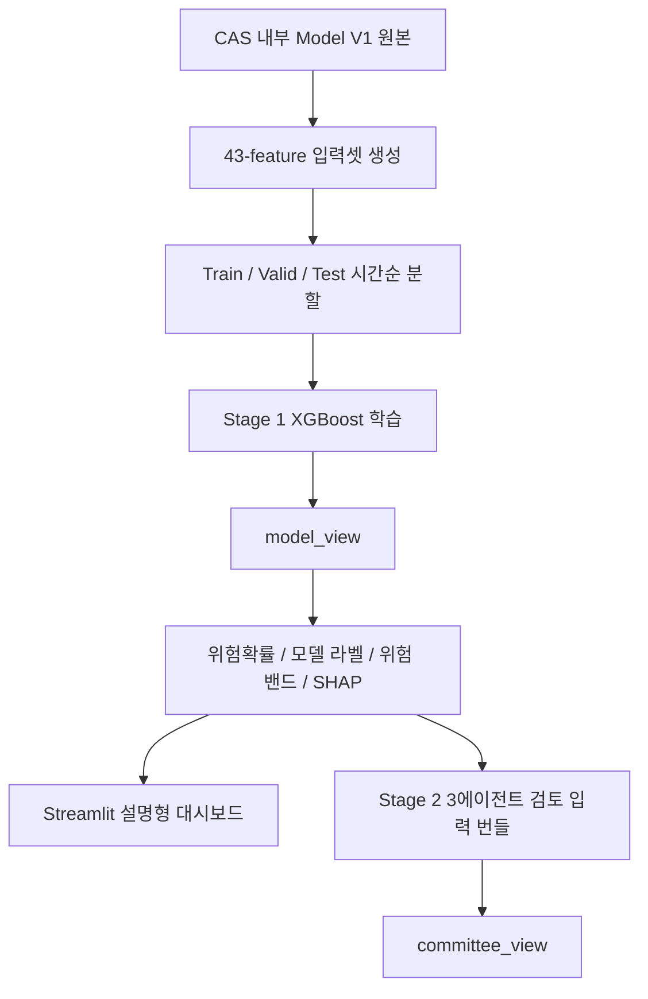

# Corporate Analysis System (CAS)

**상장기업 신용위험 조기경보 모델 및 설명형 대시보드**

Corporate Analysis System은 국내 KOSPI/KOSDAQ 상장기업의 다음 연도
신용위험을 조기에 예측하고, 예측 결과를 재무지표·산업 비교·SHAP 기반 설명과
함께 보여주는 프로젝트입니다.

현재 CAS의 기준 데이터와 실행 흐름은 모두 이 저장소 내부에서 관리합니다.
상위 로컬 작업공간이나 외부 폴더를 전제로 하지 않으며, 기준 원본은
`data/raw/ts2000/TS2000_Credit_Model_Dataset_Model_V1.csv`입니다.

## 1. 프로젝트 목표

CAS는 다음의 2단 구조를 목표로 설계합니다.

| 단계 | 현재 상태 | 역할 |
|---|---|---|
| Stage 1. 정량 예측 | 구현 및 대시보드 연결 | XGBoost로 투기등급 위험확률(`y_proba`)과 모델 라벨 산출 |
| Stage 2. 3에이전트 정성 검토 | 설계 문서 및 파이프라인 구조 정리 중 | 모델 결과를 덮어쓰지 않고 정량 해석, 외부 근거 검증, 최종 보고를 분리 |

현재 저장소의 중심은 **Stage 1 XGBoost 기반 정량 예측과 설명형 대시보드**입니다.
Stage 2는 `model_view`와 구분되는 `committee_view`를 생성하는 후속 단계로
정리되어 있습니다.

## 2. 현재 기준 데이터

| 항목 | 기준 |
|---|---|
| 분석 범위 | KOSPI, KOSDAQ 상장기업 |
| 관측 단위 | 기업-회계연도 |
| 기준 원본 | `data/raw/ts2000/TS2000_Credit_Model_Dataset_Model_V1.csv` |
| 라벨 데이터 | 5,199개 기업-연도 |
| 학습 입력 | `data/input/credit_43_features/` |
| 2026 예측 입력 | `feature_43_inference_2026.csv`, 2,427개 기업-연도 |
| 타겟 | `is_speculative` |
| 라벨 정의 | `0 = 투자적격(AAA~BBB-)`, `1 = 투기등급(BB+ 이하)` |
| 시점 정렬 | `fiscal_year=t` 재무/거시 정보로 `eval_year=t+1` 신용위험 예측 |

Model V1 전체 5,199개 행은 전체 라벨 데이터입니다. 모델 학습에는 시간순 분할
후 train 구간 3,851개 행을 사용하고, 나머지는 validation/test 성능 검증에
사용합니다.

| Split | 기준 | 행 수 | 양성 라벨 수 | 양성 비율 |
|---|---|---:|---:|---:|
| Train | `fiscal_year <= 2021` | 3,851 | 878 | 22.80% |
| Validation | `fiscal_year == 2022` | 676 | 176 | 26.04% |
| Test | `fiscal_year >= 2023` | 672 | 167 | 24.85% |

## 3. 전처리 기준

신용등급 타겟은 KOSPI와 KOSDAQ에 동일한 기준을 적용합니다.

| 구분 | 기준 |
|---|---|
| 사용 등급 | 장기 기업신용 성격의 등급만 사용 |
| 평가사 우선순위 | 국내 3대 평가사 → 기타 국내 평가사 → 외국 평가사 backfill |
| 대표 등급 선택 | 같은 기업-평가연도 안에서 가장 낮은 등급 선택 |
| 평가연도 정렬 | `eval_year = 평가연도`, `fiscal_year = eval_year - 1` |
| 상장 전 제거 | `fiscal_year < listed_year` 행 제거 |
| 누수 방지 | 미래 재무제표, 미래 거시지표, 미래 공시/뉴스 사용 금지 |

자세한 규칙은 [docs/preprocessing_rules_ko.md](docs/preprocessing_rules_ko.md)에
정리되어 있습니다.

## 4. 모델 입력과 성능

현재 대시보드의 기본 모델은 `credit_43_features` 기반 XGBoost입니다.
대시보드에 표시되는 투기등급 확률은 XGBoost raw 확률에 검증셋 기준
Platt scaling을 적용한 보정 확률입니다. Raw 확률은 산출물에
`prob_speculative_raw`로 함께 보존해 비교할 수 있습니다.
결측값은 사전 중앙값 대체 대신 XGBoost native missing 방향 학습을 사용합니다.

| 구분 | 개수 | 설명 |
|---|---:|---|
| 선택 원천 변수 | 34개 | 재무비율, 원천 재무값, 시장/규모/산업 맥락 변수, 거시 변수 |
| 원-핫 대상 | 3개 | `market`, `firm_size_group`, `industry_macro_category` |
| 최종 모델 입력 | 43개 | XGBoost 학습 및 추론 입력 |

최신 동일 split 기준 test 성능은 다음과 같습니다.

| 모델 | PR-AUC | ROC-AUC | Precision | Recall | F1 |
|---|---:|---:|---:|---:|---:|
| Dummy | 0.2485 | 0.5000 | 0.0000 | 0.0000 | 0.0000 |
| 43-feature Weighted Logistic Regression | 0.6903 | 0.8822 | 0.5560 | 0.8323 | 0.6667 |
| 38-input XGBoost | 0.7804 | 0.9098 | 0.5911 | 0.8743 | 0.7053 |
| 43-input XGBoost (native missing) | 0.7744 | 0.9110 | 0.6092 | 0.8683 | 0.7160 |

43-input XGBoost는 PR-AUC 기준으로 38-input XGBoost와 거의 유사하며,
Precision과 F1은 더 높게 나타났습니다. 현재 대시보드는 해석 가능성,
확장성, 변수 사전과의 연결성을 고려해 43-feature 입력셋을 기본으로 사용합니다.

## 5. 시스템 흐름



`model_view`는 XGBoost의 원본 판단입니다. Agent나 LLM은 이 값을 직접 수정하지
않고, 후속 Stage 2에서 정성 근거를 보완한 `committee_view`를 별도로 생성하는
구조를 목표로 합니다.

`committee_view`는 `final_committee_label`, `veto_triggered`,
`conflict_resolution`, `key_risk_factors`, `mitigating_factors`,
`evidence_summary`, `final_review_memo`를 포함합니다. 즉, 모델 판단을 바꿨는지보다
왜 최종 위원회 의견이 그렇게 정리됐는지를 설명하는 데 초점을 둡니다.

Stage 2 코드도 이 기준에 맞춰 분리되어 있습니다.
`src/cas/agents/stage2_specs.py`는 향후 Agno/Claude에 넘길 역할 계약을 정의하고,
`src/cas/agents/stage2_bundle.py`는 LangGraph state를 에이전트 입력 번들로
정규화합니다. `src/cas/agents/stage2_outputs.py`는 Agent별 출력 schema를 검증한 뒤
공통 `AgentOutput`으로 변환합니다. `src/cas/agents/stage2_runner.py`는 기본
deterministic runner와 선택형 Agno runner가 공유할 실행 인터페이스를 제공합니다.
EvidenceAuditAgent의 부채/유동성, 거시환경, 외부 근거 신호는 `src/cas/agents/signals/` 아래에서 각각 계산합니다.
`src/cas/agents/nodes/committee_node.py`는 현재 deterministic scaffold 실행 흐름을 담당하며, 최종 JSON 조립은
`src/cas/agents/committee_view.py`에서 처리합니다. `committee_view` 출력 계약은
`src/cas/agents/committee_schema.py`의 Pydantic 모델로 검증합니다.
강제 경고 기준은 `configs/agent/committee.yaml`의 `veto_rules`에서 관리합니다.

Stage 2는 CI와 기본 로컬 실행에서 `CAS_STAGE2_RUNNER=deterministic`을 사용합니다.
Agno/Claude 호출을 붙인 로컬 데모에서는 optional dependency를 설치한 뒤
`CAS_STAGE2_RUNNER=agno`, `CAS_STAGE2_MODEL=claude-sonnet-4-5-20250929`,
`ANTHROPIC_API_KEY`를 설정하면 됩니다.

외부 근거 수집은 기본적으로 꺼져 있습니다. 로컬 데모에서만 `.env`에
`CAS_ENABLE_EXTERNAL_EVIDENCE=1`과 `OPENDART_API_KEY`, `NAVER_CLIENT_ID`,
`NAVER_CLIENT_SECRET`, `TAVILY_API_KEY`를 설정하면 `news_cache` 노드가
뉴스/공시/웹 검색 근거를 EvidenceAuditAgent 입력으로 전달합니다.

## 6. 저장소 구조

```text
.
├── configs/
│   ├── agent/                   # LangGraph 노드/위원회 설정
│   └── runtime/                 # 실행 설정
├── data/
│   ├── raw/
│   │   └── ts2000/              # CAS 기준 Model V1 원본
│   ├── input/
│   │   └── credit_43_features/  # 43개 모델 입력셋, split, 2026 추론 입력
│   └── outputs/
│       ├── dashboard/           # 대시보드용 예측/SHAP/요약 산출물
│       ├── modeling/            # Stage 1 모델 artifact와 성능 진단 산출물
│       └── reports/             # CLI/에이전트 리포트 산출물
├── docs/
│   ├── preprocessing_rules_ko.md
│   ├── three_agent_credit_review_design_ko.md
│   └── pipeline/
├── scripts/
│   ├── rebuild_feature_43_dataset.py
│   ├── build_feature_43_inference_2026.py
│   ├── export_feature_43_dashboard_artifacts.py
│   ├── export_feature_43_model_diagnostics.py
│   ├── export_feature_43_variable_experiments.py
│   └── run_credit_dashboard.py
├── src/cas/
│   ├── agents/                  # LangGraph 상태, 노드, 입력 계약
│   ├── dashboard/               # Streamlit 대시보드
│   ├── reporting/               # 리포트 생성
│   └── utils/
└── tests/
```

## 7. 주요 문서

| 문서 | 내용 |
|---|---|
| [docs/preprocessing_rules_ko.md](docs/preprocessing_rules_ko.md) | 신용등급 타겟, 재무/거시 결합, 43개 입력셋 전처리 기준 |
| [docs/three_agent_credit_review_design_ko.md](docs/three_agent_credit_review_design_ko.md) | 3에이전트 기반 Stage 2 정성 검토 구조 |
| [docs/credit_dashboard_quickstart_ko.md](docs/credit_dashboard_quickstart_ko.md) | Streamlit 대시보드 실행 안내 |
| [docs/pipeline/data_pipeline.md](docs/pipeline/data_pipeline.md) | 웹 리스팅 입력과 `company_selection` 계약 |
| [data/README.md](data/README.md) | CAS 데이터 디렉터리와 재생성 흐름 |

## 8. 실행 방법

Python 3.12 환경을 사용합니다. 팀 로컬 기준으로는 `aura` 환경을 사용할 수 있습니다.

```bash
/opt/anaconda3/envs/aura/bin/python -m pip install -e ".[dev,ml,viz,dashboard]"
```

43개 입력셋 재생성:

```bash
/opt/anaconda3/envs/aura/bin/python scripts/rebuild_feature_43_dataset.py
```

2026 추론 입력 보정/검증:

```bash
/opt/anaconda3/envs/aura/bin/python scripts/import_feature_43_inference_2026_aux.py
/opt/anaconda3/envs/aura/bin/python scripts/build_feature_43_inference_2026.py
```

`import_feature_43_inference_2026_aux.py`는 2026 추론 입력의 기업규모와
`market_to_book` 보정을 위한 최소 보조 원천을 CAS 내부 `data/raw/ts2000/`에
저장합니다.

대시보드/모델 artifact 재생성:

```bash
/opt/anaconda3/envs/aura/bin/python scripts/export_feature_43_dashboard_artifacts.py
```

이 스크립트는 Stage 1 런타임과 팀 공유가 함께 사용하는 모델 artifact를
`data/outputs/modeling/feature_43_xgboost/`에 저장합니다.

모델 성능 진단 리포트 재생성:

```bash
/opt/anaconda3/envs/aura/bin/python scripts/export_feature_43_model_diagnostics.py
```

이 스크립트는 기존 예측 결과를 다시 학습하지 않고 연도/시장/산업별 성능,
threshold trade-off, 확률 보정, 대표 오류 사례를
`data/outputs/modeling/feature_43_xgboost/diagnostics/`에 저장합니다.

변수 개선 및 결측값 대체 실험 재생성:

```bash
/opt/anaconda3/envs/aura/bin/python scripts/export_feature_43_variable_experiments.py
```

이 스크립트는 시장 더미 축소, 절대금액 log/산업 백분위 변환, 중앙값 대체와
XGBoost native missing 전략을 비교해 같은 diagnostics 폴더에 저장합니다.

대시보드 실행:

```bash
/opt/anaconda3/envs/aura/bin/python scripts/run_credit_dashboard.py
```

실행 후 브라우저에서 Streamlit이 표시하는 로컬 주소로 접속합니다.

## 9. CLI 파이프라인

웹 리스팅 또는 JSON 입력은 `company_selection` 계약으로 정규화되어
LangGraph 파이프라인에 들어갑니다.

```bash
cas-agent --company-selection-file path/to/company_selection.json
```

기존 단일 회사 ID 경로도 유지합니다.

```bash
cas-agent --company-id sample-company
```

## 10. 개발 및 검증

```bash
/opt/anaconda3/envs/aura/bin/python -m ruff check .
/opt/anaconda3/envs/aura/bin/python -m mypy src/cas
/opt/anaconda3/envs/aura/bin/python -m pytest
```

현재 주요 테스트는 `company_selection` 입력 계약, 기본 예측 노드,
위원회 노드, 그래프 스모크 테스트를 포함합니다.

## 11. 운영 원칙

- CAS 기준 데이터와 실행 파일은 저장소 내부 경로만 참조합니다.
- Model V1은 CAS의 기준 원본이며, 43-feature 입력셋은 이 파일에서 재생성합니다.
- `model_view`와 `committee_view`는 분리합니다.
- 모델 예측은 LLM이나 Agent가 직접 수정하지 않습니다.
- 모든 성능 평가는 시간순 OOT split 기준으로 해석합니다.
- 미래 정보는 과거 예측에 사용하지 않습니다.

## References

- Repository: https://github.com/LADTO-develop/Corporate-Analysis-System
- License: Apache-2.0
