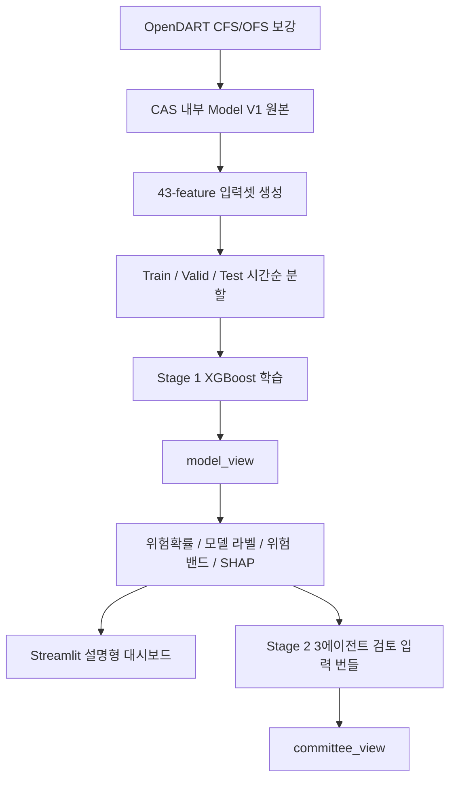

# Corporate Analysis System (CAS)

**상장기업 신용위험 조기경보 모델 및 설명형 대시보드**

Corporate Analysis System은 국내 KOSPI/KOSDAQ 상장기업의 다음 연도
신용위험을 조기에 예측하고, 예측 결과를 재무지표·산업 비교·SHAP 기반 설명과
함께 보여주는 프로젝트입니다.

현재 CAS의 기준 데이터와 실행 흐름은 모두 이 저장소 내부에서 관리합니다.
상위 로컬 작업공간이나 외부 폴더를 전제로 하지 않으며, 기준 원본은
`data/raw/ts2000/TS2000_Credit_Model_Dataset_Model_V1.csv`입니다.

## 1. 프로젝트 목표

CAS는 다음의 2단 구조로 동작합니다.

| 단계 | 현재 상태 | 역할 |
|---|---|---|
| Stage 1. 정량 예측 | 구현 및 대시보드 연결 | XGBoost로 투기등급 위험확률(`y_proba`)과 모델 라벨 산출 |
| Stage 2. 3에이전트 정성 검토 | 구현 및 파일럿 검증 완료 | 모델 결과를 덮어쓰지 않고 정량 해석, 외부 근거 검증, 최종 보고를 분리 |

현재 저장소는 **Stage 1 XGBoost 기반 정량 예측**, **설명형 대시보드**,
**Stage 2 3에이전트 위원회 검토**까지 한 흐름으로 관리합니다. Stage 2는
`model_view`와 구분되는 `committee_view`를 생성하며, deterministic runner와
선택형 Agno runner를 모두 제공합니다. 운영 live API 실행은 로컬 opt-in으로
분리하고, Codex/CI 같은 재현성 중심 환경에서는 기본적으로 외부 API를 호출하지
않습니다.

## 2. 현재 기준 데이터

| 항목 | 기준 |
|---|---|
| 분석 범위 | KOSPI, KOSDAQ 상장기업 |
| 관측 단위 | 기업-회계연도 |
| 기준 원본 | `data/raw/ts2000/TS2000_Credit_Model_Dataset_Model_V1.csv` |
| 라벨 데이터 | 5,451개 기업-연도 |
| 학습 입력 | `data/input/credit_43_features/` |
| 2026 예측 입력 | `feature_43_inference_2026.csv`, 2,427개 기업-연도 |
| 타겟 | `is_speculative` |
| 라벨 정의 | `0 = 투자적격(AAA~BBB-)`, `1 = 투기등급(BB+ 이하)` |
| 시점 정렬 | `fiscal_year=t` 재무/거시 정보로 `eval_year=t+1` 신용위험 예측 |

Model V1 전체 5,451개 행은 전체 라벨 데이터입니다. 모델 학습에는 시간순 분할
후 train 구간 3,851개 행을 사용하고, 나머지는 validation/test 성능 검증에
사용합니다.

| Split | 기준 | 행 수 | 양성 라벨 수 | 양성 비율 |
|---|---|---:|---:|---:|
| Train | `fiscal_year <= 2021` | 3,851 | 878 | 22.80% |
| Validation | `fiscal_year == 2022` | 676 | 176 | 26.04% |
| Test | `fiscal_year >= 2023` | 924 | 203 | 21.97% |

재무제표 원천값은 TS2000 기준을 유지하되, TS2000에서 연결재무제표(CFS) 값이
비어 있어 `0` 또는 `NaN`으로 들어간 기업-연도는 OpenDART 사업보고서(`11011`)로
보강합니다. 기준은 **CFS 우선, CFS가 없으면 OFS fallback**입니다.

| 보강 대상 | 보강 전 누락 후보 | OpenDART 반영 | 보강 후 누락 후보 |
|---|---:|---:|---:|
| Model V1 / 학습 기준 데이터 | 741행 | 669행 | 73행 |
| 2026 추론 입력 | 424행 | 422행 | 2행 |

2026 추론 입력에서 남은 2행은 OpenDART `corp_code`가 매칭되지 않는 특수 종목코드
기업입니다.

## 3. 전처리 기준

신용등급 타겟은 KOSPI와 KOSDAQ에 동일한 기준을 적용합니다.

| 구분 | 기준 |
|---|---|
| 사용 등급 | 장기 기업신용 성격의 등급만 사용 |
| 평가사 우선순위 | 국내 3대 평가사 → 기타 국내 평가사 → 외국 평가사 backfill |
| 대표 등급 선택 | 같은 기업-평가연도 안에서 가장 낮은 등급 선택 |
| 평가연도 정렬 | `eval_year = 평가연도`, `fiscal_year = eval_year - 1` |
| 상장 전 제거 | `fiscal_year < listed_year` 행 제거 |
| 누수 방지 | 미래 재무제표, 미래 거시지표, 미래 공시/뉴스 사용 금지 |

자세한 규칙은 [docs/preprocessing_rules_ko.md](docs/preprocessing_rules_ko.md)에
정리되어 있습니다.

## 4. 모델 입력과 성능

현재 대시보드의 기본 모델은 `credit_43_features` 기반 XGBoost입니다.
대시보드에 표시되는 투기등급 확률은 XGBoost raw 확률에 검증셋 기준
Platt scaling을 적용한 보정 확률입니다. Raw 확률은 산출물에
`prob_speculative_raw`로 함께 보존해 비교할 수 있습니다.
결측값은 사전 중앙값 대체 대신 XGBoost native missing 방향 학습을 사용합니다.

| 구분 | 개수 | 설명 |
|---|---:|---|
| 선택 원천 변수 | 34개 | 재무비율, 원천 재무값, 시장/규모/산업 맥락 변수, 거시 변수 |
| 원-핫 대상 | 3개 | `market`, `firm_size_group`, `industry_macro_category` |
| 최종 모델 입력 | 43개 | XGBoost 학습 및 추론 입력 |

2025년 신용평가 공시 라벨을 Model V1에 통합하고, CFS 누락 기업을 OpenDART
OFS fallback으로 보강한 뒤 재학습한 현재 43-feature XGBoost artifact 기준 test
성능은 다음과 같습니다.

| 모델 | PR-AUC | ROC-AUC | Precision | Recall | F1 |
|---|---:|---:|---:|---:|---:|
| 43-feature XGBoost, threshold 0.5 | 0.8329 | 0.9415 | 0.7737 | 0.7241 | 0.7481 |
| 43-feature XGBoost, tuned threshold 0.32 | 0.8329 | 0.9415 | 0.7004 | 0.8522 | 0.7689 |

보강 전 tuned 기준 test 성능은 `PR-AUC 0.7930`, `ROC-AUC 0.9286`,
`Precision 0.6603`, `Recall 0.8522`, `F1 0.7441`이었습니다. 새 기준에서는
Recall을 유지하면서 Precision과 F1이 개선되었습니다.

`industry_current_ratio_percentile`을 추가한 44개 후보 변수셋은 성능 비교 결과
43개 공식 변수셋보다 낮아 artifact를 제거했습니다. 비교 기록은
`data/outputs/modeling/feature_43_xgboost/diagnostics/feature_43_vs_44_performance_comparison.md`
에 남겨두고, 해당 칼럼은 Model V1의 후보 칼럼으로만 보존합니다.

## 5. Stage 2 상태와 파일럿 성능

Stage 2는 3개 역할(`QuantCreditAgent`, `EvidenceAuditAgent`, `ChairReportAgent`)로
구현되어 있으며, `committee_view` strict schema, decision subtype, deterministic
guardrail, 선택형 Agno runner, 외부근거 수집 노드가 연결되어 있습니다.

`committee_view`는 단순히 `보류`를 출력하는 데서 끝나지 않고, 다음처럼 세부 판단
유형을 함께 제공합니다.

| 판단 유형 | 의미 |
|---|---|
| `적격` | 추가 위험신호를 강하게 보지 않은 상태 |
| `위험 보류` | FN 보완 또는 강한 위험 근거 때문에 추가 검토가 필요한 상태 |
| `경계등급 보류` | BBB-/BB+ 등급 경계 또는 확률 경계에 있어 확정 대신 검토가 필요한 상태 |
| `과민경고 완화 보류` | 모델의 부적격 경고를 바로 확정하지 않고 완화 검토로 낮춘 상태 |
| `확인필요 보류` | 근거 부족, 외부근거 제한, 판단 충돌 때문에 추가 확인이 필요한 상태 |
| `부적격` | 위원회가 명확한 위험신호로 본 상태 |

아래 수치는 전체 기업 모집단 정확도가 아니라, FN/FP/경계등급/TP/TN을 의도적으로
섞은 **30건 stress sample**에서 Stage 2가 1차 모델 오류를 얼마나 보완하는지
확인한 파일럿 성능입니다. 2026년 전체 예측 정확도나 대시보드 개별 기업의 실제
정답률로 해석하지 않습니다.

| 기준 | Precision | Recall | F1 | 해석 |
|---|---:|---:|---:|---|
| 1차 모델 | 0.3889 | 0.4667 | 0.4243 | XGBoost 단독 판단 |
| 2차 검토대상(`보류+부적격`) | 0.5172 | 1.0000 | 0.6818 | 위험기업을 모두 추가 검토망에 올림 |
| 2차 위험신호(`risk_signal`) | 0.8889 | 0.5333 | 0.6666 | 확정 위험 신호를 더 보수적으로 제시 |
| 2차 `부적격`만 | 0.8000 | 0.2667 | 0.4000 | 고신뢰 위험 근거가 있을 때만 제한적으로 확정 |

핵심 파일럿 결과는 1차 모델 F1 `0.4243`에서 2차 위험신호 F1 `0.6666`으로
개선되었고, `보류+부적격`을 추가 검토 대상으로 보면 Recall `1.0000`을
달성했다는 점입니다. 자세한 증빙은
`data/outputs/modeling/feature_43_xgboost/diagnostics/stage2_agents/stage2_agent_improvement_summary.md`와
`data/outputs/modeling/feature_43_xgboost/diagnostics/stage2_agents/stage2_evaluation_report.md`에
정리되어 있습니다.

정상기업 과잉 보류를 줄이기 위해 `투자적격 + 기준선 아래 + 외부 치명근거 없음 +
유동성/현금흐름/자본 중 2개 이상 방어적` 조건의 TN guardrail도 추가했습니다.
관련 로컬 회귀 결과는
`data/outputs/modeling/feature_43_xgboost/diagnostics/stage2_agents/stage2_agent_performance_evidence.md`에
기록되어 있습니다.

## 6. 시스템 흐름



`model_view`는 XGBoost의 원본 판단입니다. Agent나 LLM은 이 값을 직접 수정하지
않고, 후속 Stage 2에서 정성 근거를 보완한 `committee_view`를 별도로 생성하는
구조를 유지합니다.

`committee_view`는 `final_committee_label`, `veto_triggered`,
`hidden_tail_risk_flag`, `committee_decision_type`,
`committee_decision_type_label`, `committee_risk_signal`, `conflict_resolution`,
`key_risk_factors`, `mitigating_factors`, `evidence_summary`,
`final_review_memo`를 포함합니다. 즉, 모델 판단을 바꿨는지보다 왜 최종 위원회
의견이 그렇게 정리됐는지를 설명하는 데 초점을 둡니다.
`hidden_tail_risk_flag`는 모델이 `투자적격`으로 본 기업에 직접 관련 외부 위험 근거가
확인되어 false negative 가능성을 보수적으로 점검해야 할 때 켜집니다.

Stage 2 코드도 이 기준에 맞춰 분리되어 있습니다.
`src/cas/agents/stage2_specs.py`는 Agno/LLM에 넘길 역할 계약을 정의하고,
`src/cas/agents/stage2_bundle.py`는 LangGraph state를 에이전트 입력 번들로
정규화합니다. `src/cas/agents/stage2_outputs.py`는 Agent별 출력 schema를 검증한 뒤
공통 `AgentOutput`으로 변환합니다. `src/cas/agents/stage2_runner.py`는 기본
deterministic runner와 선택형 Agno runner가 공유할 실행 인터페이스를 제공합니다.
EvidenceAuditAgent의 부채/유동성, 거시환경, 외부 근거 신호는 `src/cas/agents/signals/` 아래에서 각각 계산합니다.
`src/cas/agents/nodes/committee_node.py`는 현재 deterministic scaffold 실행 흐름을 담당하며, 최종 JSON 조립은
`src/cas/agents/committee_view.py`에서 처리합니다. `committee_view` 출력 계약은
`src/cas/agents/committee_schema.py`의 Pydantic 모델로 검증합니다.
강제 경고 기준은 `configs/agent/committee.yaml`의 `veto_rules`에서 관리합니다.

Stage 2는 CI와 기본 로컬 실행에서 `CAS_STAGE2_RUNNER=deterministic`을 사용합니다.
Agno 기반 로컬 데모에서는 optional dependency를 설치한 뒤 `CAS_STAGE2_RUNNER=agno`를
설정합니다. 기본 Agno 모드는 `CAS_STAGE2_AGNO_MODE=single`이며,
`CAS_STAGE2_MODEL_PROVIDER=openai`, `CAS_STAGE2_MODEL=gpt-4.1-mini` 기준으로
`OPENAI_API_KEY`만 있으면 실행할 수 있게 맞췄습니다. 여러 모델 관점을 비교하고 싶을 때만
`CAS_STAGE2_AGNO_MODE=multi_llm_committee`를 선택해 Claude가 정량 관점,
GPT가 외부근거/반론 관점, Gemini가 최종 종합을 맡도록 확장합니다. 이 멀티 모드에는
`ANTHROPIC_API_KEY`, `OPENAI_API_KEY`, `GOOGLE_API_KEY` 또는 `GEMINI_API_KEY`가 필요합니다.

외부 근거 수집은 기본적으로 꺼져 있습니다. 로컬 데모에서만 `.env`에
`CAS_ENABLE_EXTERNAL_EVIDENCE=1`과 `OPENDART_API_KEY`, `NAVER_CLIENT_ID`,
`NAVER_CLIENT_SECRET`, `TAVILY_API_KEY`를 설정하면 `news_cache` 노드가
뉴스/공시/웹 검색 근거를 EvidenceAuditAgent 입력으로 전달합니다.

## 7. 저장소 구조

```text
.
├── configs/
│   ├── agent/                   # LangGraph 노드/위원회 설정
│   └── runtime/                 # 실행 설정
├── data/
│   ├── raw/
│   │   ├── ts2000/              # CAS 기준 Model V1 원본
│   │   └── opendart/            # CFS/OFS 보강 원천 및 audit
│   ├── input/
│   │   └── credit_43_features/  # 현재 공식 43개 모델 입력셋, split, 2026 추론 입력
│   └── outputs/
│       ├── dashboard/           # 대시보드용 예측/SHAP/요약 산출물
│       ├── modeling/            # Stage 1 모델 artifact와 성능 진단 산출물
│       └── reports/             # CLI/에이전트 리포트 산출물
├── docs/
│   ├── preprocessing_rules_ko.md
│   ├── three_agent_credit_review_design_ko.md
│   └── pipeline/
├── scripts/
│   ├── rebuild_feature_43_dataset.py
│   ├── collect_opendart_financial_statements.py
│   ├── apply_opendart_financial_supplements.py
│   ├── apply_opendart_inference_financial_supplements.py
│   ├── build_feature_43_inference_2026.py
│   ├── export_feature_43_dashboard_artifacts.py
│   ├── export_feature_43_model_diagnostics.py
│   ├── export_feature_43_threshold_policy_experiments.py
│   └── run_credit_dashboard.py
├── src/cas/
│   ├── agents/                  # LangGraph 상태, 노드, 입력 계약
│   ├── dashboard/               # Streamlit 대시보드
│   ├── reporting/               # 리포트 생성
│   └── utils/
└── tests/
```

## 8. 주요 문서

| 문서 | 내용 |
|---|---|
| [docs/preprocessing_rules_ko.md](docs/preprocessing_rules_ko.md) | 신용등급 타겟, 재무/거시 결합, 모델 입력셋 전처리 기준 |
| [docs/three_agent_credit_review_design_ko.md](docs/three_agent_credit_review_design_ko.md) | 3에이전트 기반 Stage 2 정성 검토 구조와 구현 상태 |
| [docs/live_agno_external_api_runbook_ko.md](docs/live_agno_external_api_runbook_ko.md) | live Agno/API 로컬 실행과 Codex 정책 분리 기준 |
| [docs/credit_dashboard_quickstart_ko.md](docs/credit_dashboard_quickstart_ko.md) | Streamlit 대시보드 실행 안내 |
| [docs/pipeline/data_pipeline.md](docs/pipeline/data_pipeline.md) | 웹 리스팅 입력과 `company_selection` 계약 |
| [data/README.md](data/README.md) | CAS 데이터 디렉터리와 재생성 흐름 |

## 9. 실행 방법

Python 3.12 단일 환경을 기준으로 합니다. 새 로컬 환경은 repo 루트에서 다음처럼 만듭니다.

```bash
conda env create -f environment.yml
conda activate cas-dev
python scripts/check_dev_environment.py
```

이미 사용하는 Python 3.12 환경이 있다면 같은 환경 안에서 다음 명령으로 dev, agent,
dashboard, ML 의존성을 모두 맞춥니다.

```bash
python -m pip install -e ".[dev,agent,ml,viz,dashboard]"
python scripts/check_dev_environment.py
```

라이브 Agno/다중 LLM 회의까지 확인하려면 `.env`에 API 키를 설정한 뒤
`python scripts/check_dev_environment.py --live-agno` 또는
`python scripts/check_agno_stage2.py`를 실행합니다.

43개 입력셋 재생성:

```bash
python scripts/collect_opendart_financial_statements.py --source-kind model-v1 --all-years --fallback-ofs
python scripts/apply_opendart_financial_supplements.py
python scripts/rebuild_feature_43_dataset.py
```

2026 추론 입력 보정/검증:

```bash
python scripts/import_feature_43_inference_2026_aux.py
python scripts/build_feature_43_inference_2026.py
python scripts/collect_opendart_financial_statements.py --source-kind inference --target-fiscal-year 2025 --fallback-ofs
python scripts/apply_opendart_inference_financial_supplements.py
python scripts/build_feature_43_inference_2026.py --check-only
```

`import_feature_43_inference_2026_aux.py`는 2026 추론 입력의 기업규모와
`market_to_book` 보정을 위한 최소 보조 원천을 CAS 내부 `data/raw/ts2000/`에
저장합니다.

대시보드/모델 artifact 재생성:

```bash
python scripts/export_feature_43_dashboard_artifacts.py
```

이 스크립트는 Stage 1 런타임과 팀 공유가 함께 사용하는 모델 artifact를
`data/outputs/modeling/feature_43_xgboost/`에 저장합니다.

모델 성능 진단 리포트 재생성:

```bash
python scripts/export_feature_43_model_diagnostics.py
```

이 스크립트는 기존 예측 결과를 다시 학습하지 않고 연도/시장/산업별 성능,
threshold trade-off, 확률 보정, 대표 오류 사례를
`data/outputs/modeling/feature_43_xgboost/diagnostics/`에 저장합니다.

Threshold 정책 실험 재생성:

```bash
python scripts/export_feature_43_threshold_policy_experiments.py
```

이 스크립트는 validation 기준으로 선택한 threshold 정책을 test에서 사후 확인하고,
시장/산업별 trade-off를 정리합니다.

대시보드 실행:

```bash
python scripts/run_credit_dashboard.py
```

실행 후 브라우저에서 Streamlit이 표시하는 로컬 주소로 접속합니다.

## 10. CLI 파이프라인

웹 리스팅 또는 JSON 입력은 `company_selection` 계약으로 정규화되어
LangGraph 파이프라인에 들어갑니다.

```bash
cas-agent --company-selection-file path/to/company_selection.json
```

기존 단일 회사 ID 경로도 유지합니다.

```bash
cas-agent --company-id sample-company
```

## 11. 개발 및 검증

```bash
python scripts/check_dev_environment.py
python -m ruff check .
python -m ruff format --check .
python -m mypy src
python -m pytest tests/unit -v --cov=cas --cov-report=xml -m "not slow and not requires_llm and not requires_gpu"
python -m pytest tests/integration -v -m "not requires_llm and not requires_gpu"
```

현재 주요 테스트는 `company_selection` 입력 계약, 기본 예측 노드,
위원회 노드, 그래프 스모크 테스트를 포함합니다.

## 12. 운영 원칙

- CAS 기준 데이터와 실행 파일은 저장소 내부 경로만 참조합니다.
- Model V1은 CAS의 기준 원본이며, 공식 43-feature 입력셋은 이 파일에서 재생성합니다.
- CFS 재무제표가 비어 있는 기업-연도는 OpenDART 사업보고서 기준으로 CFS 우선,
  CFS 부재 시 OFS fallback을 적용합니다.
- `industry_current_ratio_percentile`은 공식 입력에서 제외하고 Model V1의 후보 칼럼으로만 보존합니다.
- 43-feature 입력셋과 artifact는 현재 공식 Stage 1 기준으로 유지합니다.
- `model_view`와 `committee_view`는 분리합니다.
- 모델 예측은 LLM이나 Agent가 직접 수정하지 않습니다.
- Stage 2 파일럿 수치는 hard sample 보완 성능이며, 전체 모집단 정확도로
  해석하지 않습니다.
- live Agno/API 실행은 로컬 opt-in으로 분리하고, CI/Codex 재현성 환경에서는
  외부 API 호출 없이 deterministic 경로와 캐시 산출물을 사용합니다.
- 모든 성능 평가는 시간순 OOT split 기준으로 해석합니다.
- 미래 정보는 과거 예측에 사용하지 않습니다.

## References

- Repository: https://github.com/LADTO-develop/Corporate-Analysis-System
- License: Apache-2.0
