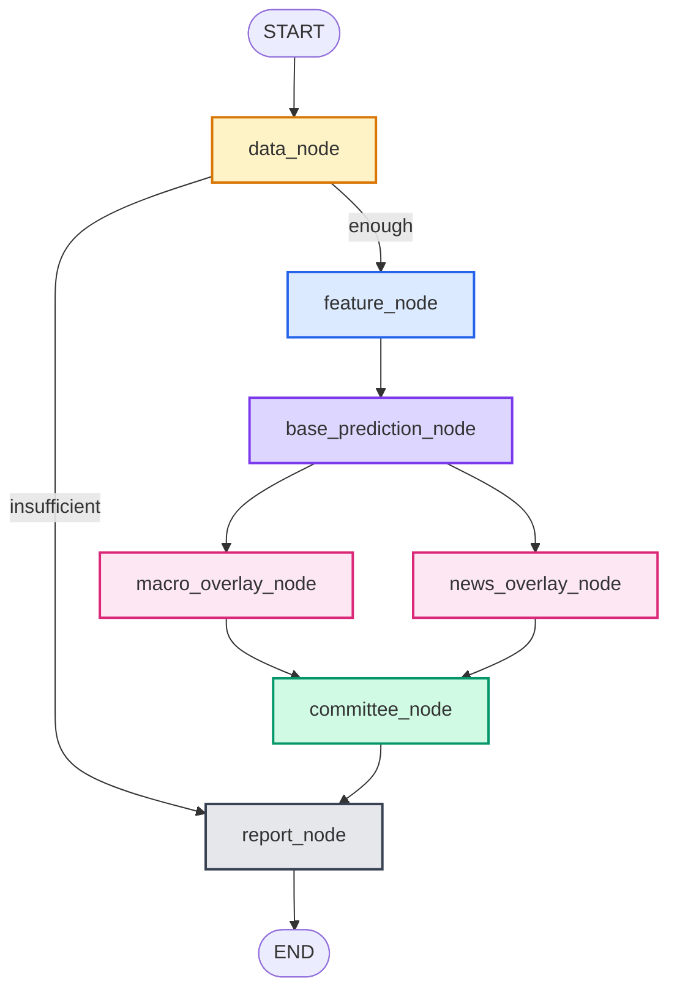

# Agent Graph

`configs/agent/graph.yaml`이 정의하는 LangGraph 파이프라인의 시각화와 상세 설명입니다.
실제 그래프는 `bfd.agents.graph.build_graph()`가 런타임에 조립합니다.

## Mermaid 다이어그램



## 노드별 책임

### `data_node`
- TS2000에서 `(corp_code, fiscal_year)` 단일 연간·연결 재무제표 행을 로드.
- 필수 컬럼(`total_assets`, `total_liabilities`, `cfo`, `operating_income`, `interest_expense` 등)
  누락 시 `insufficient_data=True` 플래그 설정.
- 조건부 엣지: `insufficient_data`이면 `report_node`로 직행, 아니면 `feature_node`로 진행.

### `feature_node`
- 현재 시장의 feature subset(`configs/market/{market}.yaml`의 `feature_subset`)에 등록된
  모든 파생변수 함수를 단일 행 DataFrame 위에서 실행.
- 결과를 `state["features"]`에 dict로 저장.

### `base_prediction_node`
- `ModelRegistry.latest(market)`로 최신 학습 아티팩트 로드.
- TabPFN/LightGBM/EBM 각각의 `predict_proba` 호출 → `BasePrediction` 3개 생성.
- 메타러너가 통합한 `ensemble_proba` 계산.
- EBM 로컬 설명에서 top-k 기여 피처 추출하여 각 `BasePrediction.feature_top_k`에 기록.

### `macro_overlay_node` (병렬)
- ECOS에서 회계연도 말 기준 스냅샷 수집 (credit spread, real rate, FX volatility).
- 휴리스틱 조정치 계산: credit spread > 2%p면 +0.02, real rate > 3%p면 +0.01.
- 조정치는 `[-0.05, +0.05]` 범위로 클리핑 — 거시는 "약한 보정"이어야 함.

### `news_overlay_node` (병렬)
- `NewsLLMFeaturizer`로 회계연도 말 기준 뉴스/공시 구조화 피처 추출.
- 감성(-0.02·firm_sentiment), 이벤트 리스크(+0.02), 계속기업 언급(+0.03) 등을 조합.
- 조정치는 `[-0.07, +0.07]` 범위로 클리핑.

### `committee_node`
- `configs/agent/committee.yaml`의 활성화된 전략들을 순차 실행:
  - **악마의 대변인**: 현재 다수 의견에 반대되는 논거 강제 생성.
  - **6모자**: 백→적→흑→황→녹→청 순으로 각 모자별 LLM 호출.
  - **명목집단법**: N명의 독립 유권자가 각자 Borda 순위 + 판정.
  - **스텝래더**: 참가자가 점진적으로 늘어나며 합의 형성.
- 모든 의견이 `committee_opinions`에 누적된 뒤 weighted vote로 최종 판정·신뢰도 도출.
- 신뢰도가 `uncertainty_threshold` 미만이면 `uncertain` 판정.

### `report_node`
- `bfd.reporting.export.render_report`로 JSON + Markdown 리포트 생성.
- `data/processed/reports/{corp_code}/{fiscal_year}.{json,md}`에 저장.
- 감사 트레일이 `audit`, EBM 설명이 `base_predictions[*].feature_top_k`에 포함됨.

## State reducer 동작

| 필드 | Reducer | 효과 |
|------|---------|------|
| `audit` | `append_audit` | 노드가 새 `AuditEntry`를 return하면 기존 리스트에 append |
| `committee_opinions` | `append_opinions` | 각 위원회 전략의 opinions가 누적 |
| `base_predictions` | `merge_dict` | 모델별 예측이 같은 dict에 누적 |
| `artifacts` | `merge_dict` | 여러 노드가 만든 파일 경로가 하나의 dict로 병합 |
| 그 외 | (없음 — 덮어쓰기) | `features`, `macro_overlay` 등은 생성 노드에서 전체 교체 |

Reducer가 없는 필드에 병렬 노드 두 개가 동시에 써넣으면 LangGraph는 마지막 값으로
overwrite합니다. 그래서 `macro_overlay`와 `news_overlay`는 서로 다른 필드명을 씁니다.

## 체크포인터

기본값은 `MemorySaver` — 세션 내에서만 state가 보존되고 프로세스 종료 시 사라집니다.
운영/디버깅용으로 SQLite로 교체하려면 `configs/agent/graph.yaml`에서:

```yaml
checkpointer:
  kind: sqlite
  sqlite_path: ./data/interim/langgraph_checkpoints.db
```

## Thread ID

`run_once(thread_id="...")`로 넘기는 값은 체크포인터의 대화 세션 식별자입니다.
같은 `thread_id`로 재호출하면 기존 state를 이어받아 실행이 계속됩니다 (예: 중단된
위원회 노드부터 재개).
