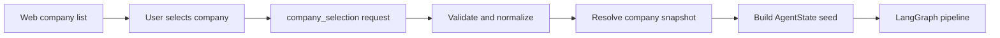

# Data Pipeline

이 문서는 CAS의 데이터가 웹 입력에서 분석 리포트까지 이동하는 전체 흐름을 단계별로 고정한다. 첫 단계는 사용자가 웹 화면에서 리스팅된 상장기업을 선택하고, 그 선택을 분석 파이프라인이 이해하는 표준 입력으로 넘기는 과정이다.

## 1. Web Listing Ingress

### 목적

웹 화면의 기업 목록은 사용자가 보는 UI 상태이고, 분석 파이프라인은 결정론적으로 재실행 가능한 `AgentState` 입력을 필요로 한다. 따라서 웹에서 넘어온 선택값은 바로 모델 입력으로 쓰지 않고, 먼저 표준 `company_selection` 이벤트로 검증하고 정규화한다.



### 현재 저장소 기준

현재 MVP에서 웹 리스팅은 대시보드 아티팩트의 `company_latest.csv`가 담당한다.

- 로더: `src/cas/dashboard/data_loader.py`
- 선택 UI: `src/cas/dashboard/credit_app.py`의 `pick_selected_company`
- 입력 계약/정규화: `src/cas/agents/contracts/company_selection.py`
- 기본 키: `stock_code + fiscal_year`
- 표시/필터 필드: `market`, `corp_name`, `stock_code`, `firm_size_group`, `industry_macro_category`, `fiscal_year`, `eval_year`
- 파이프라인 표준 상태: `src/cas/agents/state.py`의 `AgentState`

향후 별도 웹 API가 붙어도 같은 계약을 유지한다. Streamlit의 선택 행, React/Vue 화면의 선택 이벤트, CSV 업로드의 단일 행 모두 아래 입력으로 정규화된다.

### 입력 계약

웹에서 분석 요청으로 넘기는 최소 단건 입력은 다음 형태다.

```json
{
  "request_id": "req_20260511_000001",
  "source": "web_listing",
  "selected_at": "2026-05-11T04:30:00Z",
  "as_of_date": "2026-05-11",
  "company": {
    "market": "KOSPI",
    "stock_code": "005930",
    "corp_name": "삼성전자(주)",
    "corp_code": "00126380"
  },
  "analysis": {
    "fiscal_year": 2024,
    "eval_year": 2025
  }
}
```

필수 필드는 `market`, `stock_code`, `corp_name`이다. `corp_code`는 DART 연동 안정성을 위해 가능하면 함께 넘긴다. 없으면 OpenDART `corpCode.xml` 캐시에서 `stock_code` 기준으로 자동 보강한다. `fiscal_year` 또는 `eval_year`가 없으면 서버가 `as_of_date` 기준으로 조회 가능한 최신 스냅샷을 선택한다.

### 검증 규칙

웹 입력은 다음 순서로 검증한다.

1. `market`은 `KOSPI` 또는 `KOSDAQ`으로 정규화한다.
2. `stock_code`는 숫자 문자열로 받고 6자리로 zero-padding한다.
3. `corp_name`은 앞뒤 공백과 보이지 않는 문자를 제거한다.
4. `fiscal_year`와 `eval_year`가 모두 있으면 `eval_year = fiscal_year + 1` 관계를 확인한다.
5. `as_of_date` 이후의 재무, 공시 데이터는 조회하지 않는다. 공시 조회 기준일은 `as_of_date`가 있으면 그 날짜, 없으면 `eval_year` 말일을 사용한다.
6. `stock_code + fiscal_year`가 여러 행에 매칭되면 최신 `selected_at`이 아니라 데이터 기준 키로만 하나를 결정한다.
7. 매칭 실패, 중복, 필수값 누락은 모델을 실행하지 않고 `insufficient_data` 상태로 종료한다.

### 정규화 결과

검증된 웹 입력은 LangGraph 시작 상태로 다음처럼 변환한다.

```json
{
  "company_id": "KOSPI-005930-2024",
  "company_name": "삼성전자(주)",
  "market": "KOSPI",
  "analysis_year": 2025,
  "processed_company": {
    "company_id": "KOSPI-005930-2024",
    "company_name": "삼성전자(주)",
    "market": "KOSPI",
    "stock_code": "005930",
    "corp_code": "00126380",
    "fiscal_year": 2024,
    "eval_year": 2025,
    "source": "web_listing",
    "request_id": "req_20260511_000001"
  },
  "processed_company_list_ref": "data/outputs/dashboard/feature_43_mvp/company_latest.csv"
}
```

이 시점부터 기존 온라인 플로우의 `data -> feature_store -> news_cache -> xgboost_inference -> rule_engine -> agno_agents -> json_schema -> report` 구간으로 진입한다.

### 실패 응답

웹 선택값이 분석 가능한 회사 스냅샷으로 해석되지 않으면 다음 오류 그룹 중 하나로 반환한다.

| 오류 그룹 | 조건 | 사용자 메시지 방향 |
|---|---|---|
| `missing_required_field` | 시장, 종목코드, 회사명 누락 | 기업을 다시 선택하도록 안내 |
| `invalid_identifier` | 종목코드 형식 오류 | 6자리 종목코드 기준 안내 |
| `snapshot_not_found` | 기준 연도 행 없음 | 분석 가능한 최신 연도 표시 |
| `ambiguous_snapshot` | 동일 키 중복 | 서버 데이터 정비 필요 메시지 |
| `as_of_date_violation` | 미래 데이터 참조 위험 | 기준일을 조정하도록 안내 |

실패도 감사 추적에 남긴다. 모델, LLM, 리포트 노드는 실행하지 않는다.

## 이후 단계 자리

다음 단계에서 이어서 정의할 데이터 파이프라인은 아래 순서로 확장한다.

1. 기업 스냅샷을 feature store 조회 키로 변환
2. TS2000 재무 원천값이 비어 있으면 OpenDART 사업보고서 CFS 우선, OFS fallback 기준으로 보강
3. 보강 후 재무비율, 증감률, 플래그, 산업 내 백분위를 재계산하고 43개 모델 입력 변수에 매핑
4. DART/뉴스/거시 캐시의 `as_of_date` 기준 조회
5. XGBoost 추론과 SHAP 로컬 설명 생성
6. 룰 엔진, 다중 에이전트 해석, strict JSON 검증
7. 웹 대시보드 및 리포트 저장
